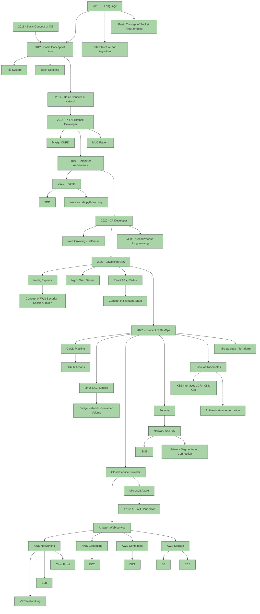

<!--  -->

### My Knowledge Tree
<!-- My Soft Skills -->

```mermaid
graph TD
    classDef default fill:#A9D4A7,stroke:#363A3D,stroke-width:1px;
    classDef current fill:#A8D0F0,stroke:#363A3D,stroke-width:1px;
    classDef ready fill:#949EA6,color:#363A3D,stroke:#363A3D,stroke-width:1px;

    PRE_STUDY_C ---> PRE_STUDY_LINUX
    PRE_STUDY_OS --> PRE_STUDY_LINUX

    PRE_STUDY_C[2011 - C Language]
    PRE_STUDY_OS[2011 - Basic Concept of OS]

    PRE_STUDY_C ---> PRE_STUDY_C_ALGORITHM[Data Structure and Algorithm]
    PRE_STUDY_C --> PRE_STUDY_C_SOCKET[Basic Concept of Socket Programming]

    PRE_STUDY_LINUX[2012 - Basic Concept of Linux]
    PRE_STUDY_LINUX --> PRE_STUDY_LINUX_FS[File System]
    PRE_STUDY_LINUX --> PRE_STUDY_LINUX_BASH[Bash Scripting]
    PRE_STUDY_LINUX ----> PRE_STUDY_NETWORK[2012 - Basic Concept of Network]


    PRE_STUDY_NETWORK --> NEWWAYNET_PHP

    NEWWAYNET_PHP[2016 - PHP Fullstack Developer]
    NEWWAYNET_PHP --> NEWWAYNET_DB[Mysql, CURD]
    NEWWAYNET_PHP ---> BU
    NEWWAYNET_PHP --> NEWWAYNET_MVC[MVC Pattern]

    BU[2019 - Computer Architecture]
    BU --> BU_PYTHON[2020 - Python] 
    BU_PYTHON --> BU_PYTHON_TEST[TDD]
    BU_PYTHON --> BU_PYTHON_PYTHONIC[Write a code pythonic way]
    BU ----> BU_CSHARP[2020 - C# Developer]

    BU_CSHARP --> BU_CSHARP_SELENIUM[Web Crawling - Selenium]
    BU_CSHARP ---> BU_FINAL_PROJECT
    BU_CSHARP --> BU_CSHARP_MULTITHREAD[Multi Thread/Process Programming]

    BU_FINAL_PROJECT[2021 - Javascript ES6]
    BU_FINAL_PROJECT --> BU_FINAL_PROJECT_NODE
    BU_FINAL_PROJECT --> BU_FINAL_PROJECT_NGINX
    BU_FINAL_PROJECT --> BU_FINAL_PROJECT_REACT
    BU_FINAL_PROJECT -----> DEVOPS

    BU_FINAL_PROJECT_REACT[React 16.x, Redux]
    BU_FINAL_PROJECT_REACT --> BU_FINAL_PROJECT_REACT_STATE[Concept of Frontend State]
    

    BU_FINAL_PROJECT_NODE[Node, Express]
    BU_FINAL_PROJECT_NODE --> BU_FINAL_PROJECT_NODE_JWT[Concept of Web Security - Session, Token]
    

    BU_FINAL_PROJECT_NGINX[Nginx Web Server]

    DEVOPS[2022 - Concept of DevOps]
    DEVOPS --> DEVOPS_CICD[CI/CD Pipeline]
    DEVOPS ----> DEVOPS_DOCKER[Linux LXC, Docker]
    DEVOPS --------> CLOUD

    DEVOPS -----> SECURITY
    DEVOPS ---> DEVOPS_K8S[Basic of Kubernetes]
    DEVOPS --> IAC[Infra as code - Terraform]


    DEVOPS_CICD --> DEVOPS_CICD_GITACTION[Github Actions]
    DEVOPS_DOCKER --> DEVOPS_DOCKER_ETC[Bridge Network, Container Volume]    
    DEVOPS_K8S --> DEVOPS_K8S_PODNETWORK[K8S Interfaces : CRI, CNI, CSI]
    DEVOPS_K8S ---> DEVOPS_K8S_AUTH[Authentication, Autorization]

    SECURITY[Security]
    SECURITY --> SECURITY_NETWORK[Network Security]
    SECURITY_NETWORK --> SECURITY_NETWORK_ISMS[ISMS]
    SECURITY_NETWORK --> SECURITY_NETWORK_SEG[Network Segmentation, Connection]
    
    CLOUD[Cloud Service Provider]
    CLOUD ----> CLOUD_AWS[Amazon Web service]
    CLOUD --> CLOUD_AZURE[Microsoft Azure]

    CLOUD_AZURE --> CLOUD_AZURE_AD[Azure AD, AD Connector]

    CLOUD_AWS --> CLOUD_AWS_NETWORK
    CLOUD_AWS --> CLOUD_AWS_CONPUTING
    CLOUD_AWS --> CLOUD_AWS_CONTAINER
    CLOUD_AWS --> CLOUD_AWS_STORAGE


    CLOUD_AWS_NETWORK[AWS Networking]
    CLOUD_AWS_CONPUTING[AWS Computing]
    CLOUD_AWS_CONTAINER[AWS Containers]
    CLOUD_AWS_STORAGE[AWS Storage]

    CLOUD_AWS_NETWORK ----> CLOUD_AWS_VPC
    CLOUD_AWS_NETWORK ---> CLOUD_AWS_NETWORK_ELB
    CLOUD_AWS_NETWORK --> CLOUD_AWS_NETWORK_CDN

    CLOUD_AWS_CONPUTING --> CLOUD_AWS_COMPUTING_EC2
    CLOUD_AWS_CONTAINER --> CLOUD_AWS_CONTAINER_EKS

    CLOUD_AWS_STORAGE --> CLOUD_AWS_STORAGE_S3
    CLOUD_AWS_STORAGE --> CLOUD_AWS_STORAGE_EBS

    CLOUD_AWS_VPC[VPC Networking]
    CLOUD_AWS_NETWORK_ELB[ELB]
    CLOUD_AWS_NETWORK_CDN[CloudFront]
    CLOUD_AWS_CONTAINER_EKS[EKS]
    CLOUD_AWS_COMPUTING_EC2[EC2]
    CLOUD_AWS_STORAGE_S3[S3]
    CLOUD_AWS_STORAGE_EBS[EBS]
```

<!-- My Hard Skills -->
